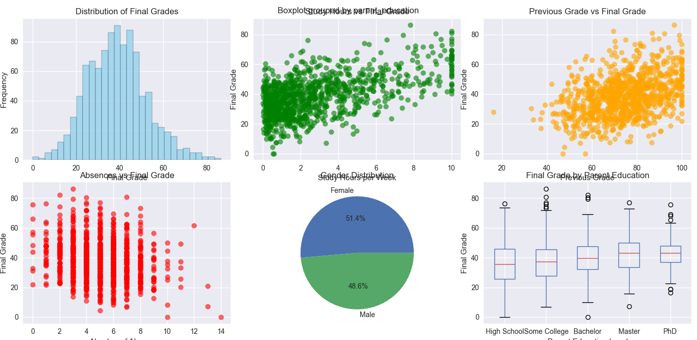
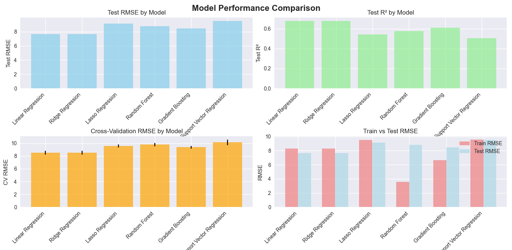
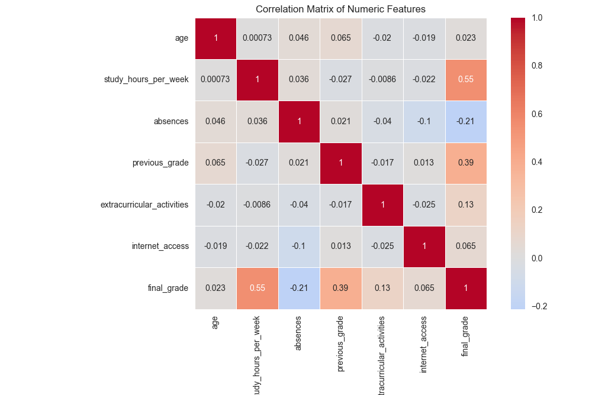

# Student Performance Prediction System

A comprehensive machine learning system that predicts student academic performance based on various demographic, social, and academic factors. The system compares multiple algorithms and provides insights into the most important factors affecting student success.

## Author
**Edze Worla Alex**

## Features

- **Multiple ML Algorithms**: Compares Linear Regression, Ridge, Lasso, Random Forest, Gradient Boosting, and SVR
- **Automated EDA**: Comprehensive exploratory data analysis with visualizations
- **Feature Engineering**: Automated preprocessing for numerical and categorical data
- **Hyperparameter Tuning**: Grid search optimization for best models
- **Feature Importance**: Analysis of which factors most impact student performance
- **Cross-Validation**: Robust model evaluation with k-fold cross-validation
- **Model Persistence**: Save and load trained models
- **Single Prediction**: Predict performance for individual students

## Problem Statement

Educational institutions need to identify students at risk of poor academic performance early in the semester to provide targeted interventions. This system uses various student characteristics to predict final grades, helping educators:

- Identify at-risk students early
- Allocate resources effectively
- Design targeted intervention programs
- Understand factors that contribute to academic success

## Dataset Features

The system uses the following student characteristics:

### Demographics
- **Gender**: Male/Female
- **Age**: Student age (14-19 years)

### Family Background
- **Parent Education**: High School, Some College, Bachelor, Master, PhD
- **Family Income**: Low, Medium, High

### Academic Factors
- **Study Hours per Week**: Time spent studying
- **Absences**: Number of missed classes
- **Previous Grade**: Grade from previous semester/course
- **Extracurricular Activities**: Number of activities (0-3)

### Social & Health Factors
- **Social Support**: Low, Medium, High
- **Health Status**: Poor, Good, Excellent
- **Internet Access**: Binary (0/1)

### Target Variable
- **Final Grade**: Academic performance score (0-100)

## Technical Architecture

### Models Implemented
1. **Linear Regression**: Baseline linear model
2. **Ridge Regression**: L2 regularized linear model
3. **Lasso Regression**: L1 regularized linear model
4. **Random Forest**: Ensemble of decision trees
5. **Gradient Boosting**: Sequential boosting algorithm
6. **Support Vector Regression**: Kernel-based regression

### Evaluation Metrics
- **RMSE**: Root Mean Square Error
- **MAE**: Mean Absolute Error
- **R²**: Coefficient of determination
- **Cross-validation scores**: 5-fold CV for robust evaluation

## Requirements

```
pandas>=1.3.0
numpy>=1.21.0
scikit-learn>=1.0.0
matplotlib>=3.4.0
seaborn>=0.11.0
plotly>=5.0.0
joblib>=1.0.0
```

## Installation

1. Clone the repository:
```bash
git clone https://github.com/edze-worla-alex/student-performance-prediction.git
cd student-performance-prediction
```

2. Install dependencies:
```bash
pip install -r requirements.txt
```

## Usage

### Quick Start

```python
from student_performance_predictor import StudentPerformancePredictor
import pandas as pd

# Initialize the predictor
predictor = StudentPerformancePredictor(random_state=42)

# Load your data (or generate sample data)
df = predictor.load_data('your_student_data.csv')  # or df = predictor.load_data() for sample data

# Explore the data
predictor.explore_data(df, target_column='final_grade')

# Preprocess and train models
X, y = predictor.preprocess_data(df, target_column='final_grade')
X_test, y_test = predictor.train_models(X, y, test_size=0.2)

# Compare model performance
predictor.plot_model_comparison()

# Predict for a new student
student_profile = {
    'gender': 'Female',
    'age': 17,
    'parent_education': 'Bachelor',
    'family_income': 'Medium',
    'study_hours_per_week': 6.5,
    'absences': 3,
    'previous_grade': 82.5,
    'extracurricular_activities': 2,
    'social_support': 'High',
    'health_status': 'Good',
    'internet_access': 1
}

predicted_grade = predictor.predict_single_student(student_profile)
print(f"Predicted final grade: {predicted_grade:.2f}")
```

### Advanced Usage

```python
# Perform hyperparameter tuning
best_model = predictor.hyperparameter_tuning(X, y, model_name='Random Forest')

# Analyze feature importance
predictor.plot_feature_importance(top_n=15)

# Save the trained model
predictor.save_model('my_student_model.pkl')

# Load a saved model
new_predictor = StudentPerformancePredictor()
new_predictor.load_model('my_student_model.pkl')

# Make batch predictions
new_students_df = pd.read_csv('new_students.csv')
predictions = new_predictor.predict(new_students_df)
```

## Data Format

Your CSV file should contain the following columns:

```csv
gender,age,parent_education,family_income,study_hours_per_week,absences,previous_grade,extracurricular_activities,social_support,health_status,internet_access,final_grade
Female,17,Bachelor,Medium,6.5,3,82.5,2,High,Good,1,85.2
Male,16,High School,Low,4.2,8,75.0,1,Medium,Good,1,78.1
...
```

## Model Performance Examples

Based on sample data, typical results include:

```
=== MODEL COMPARISON ===
Model               Test_RMSE  Test_R2   CV_RMSE
Random Forest       6.234      0.847     6.456
Gradient Boosting   6.891      0.815     7.023
Ridge Regression    8.123      0.732     8.234
Lasso Regression    8.456      0.718     8.567
Linear Regression   8.789      0.695     8.901
SVR                 9.234      0.672     9.345

Best Model: Random Forest
Test RMSE: 6.234
Test R²: 0.847
```

## Feature Importance Analysis

Typical feature importance rankings:

1. **Previous Grade** (0.342) - Strongest predictor
2. **Study Hours per Week** (0.156) - Study habits matter
3. **Absences** (0.128) - Attendance is crucial
4. **Parent Education** (0.098) - Family background influence
5. **Health Status** (0.067) - Physical well-being impact
6. **Social Support** (0.052) - Support system importance
7. **Age** (0.043) - Maturity factor
8. **Extracurricular Activities** (0.039) - Well-rounded development
9. **Family Income** (0.035) - Economic factors
10. **Internet Access** (0.032) - Technology access

## Key Insights

### Academic Factors
- **Previous performance is the strongest predictor** of future grades
- **Study hours show positive correlation** with final grades
- **Attendance matters significantly** - each absence impacts performance

### Socioeconomic Factors
- **Parent education level** positively correlates with student performance
- **Family income** shows moderate influence on academic outcomes
- **Internet access** provides slight advantage in modern education

### Personal Factors
- **Health status** significantly impacts academic performance
- **Social support** systems contribute to better outcomes
- **Extracurricular activities** show positive but moderate impact

## Visualizations

The system generates comprehensive visualizations:

### 1. Data Exploration Plots
- Distribution of final grades
- Scatter plots showing relationships between features and target
- Correlation heatmap
- Categorical variable distributions

### 2. Model Performance Plots
- Test RMSE comparison across models
- R² score comparison
- Cross-validation results with error bars
- Train vs Test performance comparison

### 3. Feature Analysis Plots
- Feature importance rankings
- Top contributing factors visualization

## Hyperparameter Tuning

The system includes automated hyperparameter optimization for:

### Random Forest
- `n_estimators`: [50, 100, 200]
- `max_depth`: [None, 10, 20]
- `min_samples_split`: [2, 5, 10]
- `min_samples_leaf`: [1, 2, 4]

### Gradient Boosting
- `n_estimators`: [50, 100, 200]
- `learning_rate`: [0.01, 0.1, 0.2]
- `max_depth`: [3, 5, 7]

### Ridge/Lasso Regression
- `alpha`: [0.1, 1.0, 10.0, 100.0]

### Support Vector Regression
- `C`: [0.1, 1, 10]
- `gamma`: ['scale', 'auto']
- `kernel`: ['rbf', 'linear']

## API Reference

### StudentPerformancePredictor Class

#### Initialization
```python
predictor = StudentPerformancePredictor(random_state=42)
```

#### Main Methods

**`load_data(filepath=None, df=None)`**
- Load data from CSV file or DataFrame
- Returns: pandas DataFrame

**`explore_data(df, target_column='final_grade')`**
- Perform exploratory data analysis
- Generates visualization plots

**`preprocess_data(df, target_column='final_grade')`**
- Preprocess features for ML models
- Returns: (X, y) feature matrix and target vector

**`train_models(X, y, test_size=0.2)`**
- Train all models and compare performance
- Returns: (X_test, y_test) test sets

**`hyperparameter_tuning(X, y, model_name=None)`**
- Optimize hyperparameters for specified model
- Returns: Best estimator

**`predict(X)`**
- Make predictions using best model
- Returns: numpy array of predictions

**`predict_single_student(student_data)`**
- Predict grade for single student
- Returns: float prediction

**`save_model(filepath)`**
- Save trained model and preprocessor

**`load_model(filepath)`**
- Load saved model

**`plot_model_comparison()`**
- Generate model performance comparison plots

**`plot_feature_importance(top_n=15)`**
- Plot feature importance for best model

## File Structure

```
student-performance-prediction/
├── student_performance_predictor.py  # Main implementation
├── README.md                         # This file
├── requirements.txt                  # Python dependencies
├── examples/
│   ├── basic_usage.py               # Basic usage example
│   ├── advanced_analysis.py         # Advanced features demo
│   └── batch_prediction.py          # Batch prediction example
├── data/
│   ├── sample_student_data.csv      # Sample dataset
│   └── data_description.txt         # Data dictionary
├── docs/
│   ├── *.png      # Sample images
├── models/
│   └── student_performance_model.pkl         # Example saved model
├── notebooks/
│   ├── EDA_analysis.ipynb           # Detailed exploratory analysis
│   ├── model_comparison.ipynb       # Model comparison notebook
│   └── feature_engineering.ipynb    # Feature engineering experiments
└── tests/
    ├── test_predictor.py            # Unit tests
    └── test_data_processing.py      # Data processing tests
```

## Educational Applications

### For Educators
1. **Early Warning System**: Identify at-risk students at the beginning of semester
2. **Resource Allocation**: Prioritize support for students with highest predicted risk
3. **Intervention Planning**: Design targeted programs based on feature importance
4. **Progress Monitoring**: Track improvement after interventions

### For Students
1. **Self-Assessment**: Understand factors that impact academic performance
2. **Goal Setting**: Set realistic targets based on current profile
3. **Habit Formation**: Focus on controllable factors like study hours and attendance

### For Administrators
1. **Policy Making**: Understand systemic factors affecting student success
2. **Resource Planning**: Allocate budget based on predictive insights
3. **Program Evaluation**: Measure effectiveness of support programs

## Model Interpretability

### SHAP Values Integration
For enhanced interpretability, integrate SHAP (SHapley Additive exPlanations):

```python
import shap

# Get SHAP values for feature importance
explainer = shap.TreeExplainer(predictor.best_model.named_steps['regressor'])
X_processed = predictor.best_model.named_steps['preprocessor'].transform(X_test)
shap_values = explainer.shap_values(X_processed)

# Plot SHAP summary
shap.summary_plot(shap_values, X_processed, feature_names=predictor.feature_names)
```

## Ethical Considerations

### Bias and Fairness
- **Gender Bias**: Monitor for gender-based prediction disparities
- **Socioeconomic Bias**: Be aware of potential discrimination against low-income students
- **Cultural Sensitivity**: Consider cultural factors not captured in data

### Privacy and Transparency
- **Data Privacy**: Ensure student data is handled according to FERPA guidelines
- **Model Transparency**: Provide clear explanations for predictions
- **Consent**: Obtain appropriate permissions for data usage

### Responsible AI
- **Human Oversight**: Predictions should supplement, not replace, human judgment
- **Regular Auditing**: Monitor model performance across different student groups
- **Feedback Loops**: Incorporate teacher feedback to improve predictions

## Performance Optimization

### For Large Datasets
```python
# Use sampling for initial exploration
sample_df = df.sample(n=10000, random_state=42)

# Use parallel processing
from sklearn.externals import joblib
predictor = StudentPerformancePredictor()
predictor.models['Random Forest'].set_params(n_jobs=-1)

# Feature selection for high-dimensional data
from sklearn.feature_selection import SelectKBest, f_regression
selector = SelectKBest(score_func=f_regression, k=20)
```


## Troubleshooting

### Common Issues

**1. Memory Issues with Large Datasets**
```python
# Solution: Use chunking or sampling
chunk_size = 1000
for chunk in pd.read_csv('large_file.csv', chunksize=chunk_size):
    # Process chunks separately
    pass
```

**2. Poor Model Performance**
- Check for data quality issues
- Verify feature engineering steps
- Consider additional features
- Try ensemble methods

**3. Overfitting**
- Increase regularization parameters
- Reduce model complexity
- Use more cross-validation folds
- Collect more training data

**4. Feature Scaling Issues**
- Ensure StandardScaler is applied to numeric features
- Check for extreme outliers
- Consider robust scaling for skewed data

## Extensions and Improvements

### Possible Enhancements
1. **Deep Learning Models**: Implement neural networks with TensorFlow/PyTorch
2. **Time Series Analysis**: Incorporate temporal patterns in student performance
3. **Multi-output Prediction**: Predict multiple metrics simultaneously
4. **Clustering Analysis**: Identify student segments for targeted interventions
5. **Ensemble Methods**: Combine multiple models for better performance
6. **Feature Engineering**: Create more sophisticated derived features
7. **Online Learning**: Update models with new data continuously

### Integration Possibilities
1. **Learning Management Systems**: Direct integration with Canvas, Blackboard
2. **Student Information Systems**: Connect with existing school databases
3. **Mobile Apps**: Create mobile interface for teachers and students
4. **Dashboard Development**: Build interactive dashboards with Plotly Dash
5. **API Development**: Create REST API for model serving

## Research Applications

This system can be used for educational research:

### Academic Studies
- Investigate factors affecting student performance across different demographics
- Compare intervention effectiveness using predictive models
- Study correlation between various socioeconomic factors and academic success

### Publication Opportunities
- Educational data mining conferences (EDM)
- Learning analytics and knowledge discovery journals
- Machine learning in education workshops

## License

This project is licensed under the MIT License - see the LICENSE file for details.

## Contributing

1. Fork the repository
2. Create a feature branch (`git checkout -b feature/amazing-feature`)
3. Commit your changes (`git commit -m 'Add amazing feature'`)
4. Push to the branch (`git push origin feature/amazing-feature`)
5. Open a Pull Request

## Citation

If you use this system in your research, please cite:

```bibtex
@software{student_performance_predictor,
  author = {Alex, Edze Worla},
  title = {Student Performance Prediction System},
  year = {2025},
  url = {https://github.com/edze-worla-alex/student-performance-prediction}
}
```

## Contact

**Edze Worla Alex**
- GitHub: [@edze-worla-alex]
- Email: edze.worla@gmail.com

---

*This project demonstrates the application of machine learning in educational analytics to support student success and institutional decision-making.*
